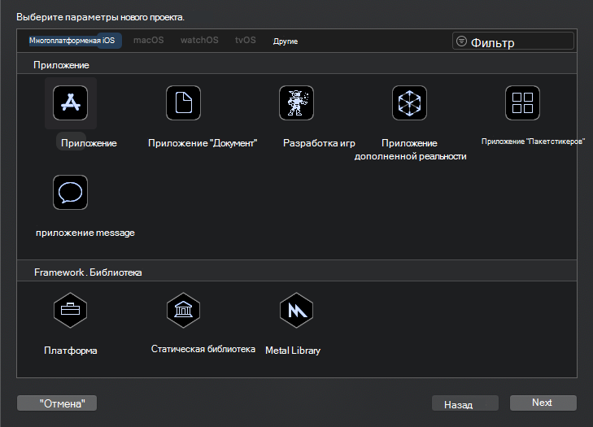
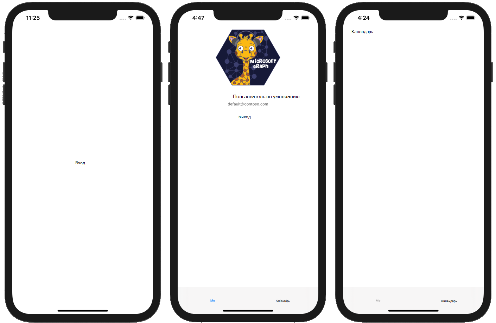

<!-- markdownlint-disable MD002 MD041 -->

Начните с создания нового проекта SWIFT.

1. Откройте Xcode. В меню **файл** выберите пункт **создать**, а затем — **проект**.
1. Выберите шаблон **приложения с одним представлением** и нажмите кнопку **Далее**.

    

1. Задайте для **имени продукта** значение `GraphTutorial` **SWIFT**и **язык** .
1. Заполните оставшиеся поля и нажмите кнопку **Далее**.
1. Выберите расположение для проекта и нажмите кнопку **создать**.

## <a name="install-dependencies"></a>Установка зависимостей

Перед перемещением установите некоторые дополнительные зависимости, которые будут использоваться позже.

- [Библиотека проверки подлинности Microsoft (MSAL) для iOS](https://github.com/AzureAD/microsoft-authentication-library-for-objc) для проверки подлинности в Azure AD.
- [Поставщик проверки подлинности MSAL для цели C](https://github.com/microsoftgraph/msgraph-sdk-objc-auth) , чтобы подключить MSAL с помощью пакета SDK Microsoft Graph.
- [Пакет SDK Microsoft Graph для задания на языке C](https://github.com/microsoftgraph/msgraph-sdk-objc) для совершения вызовов в Microsoft Graph.
- [Пакет SDK моделей Microsoft Graph для задания с](https://github.com/microsoftgraph/msgraph-sdk-objc-models) строго типизированными объектами, представляющими ресурсы Microsoft Graph, такие как "Пользователи" или "события".

1. Выйдите из Xcode.
1. Откройте терминал и измените каталог на путь к проекту **графтуториал** .
1. Выполните следующую команду, чтобы создать Podfile.

    ```Shell
    pod init
    ```

1. Откройте Podfile и добавьте следующие строки сразу после `use_frameworks!` строки.

    ```Ruby
    pod 'MSAL', '~> 0.3.0'
    pod 'MSGraphMSALAuthProvider', '~> 0.1.1'
    pod 'MSGraphClientSDK', ' ~> 0.1.3'
    pod 'MSGraphClientModels', '~> 0.1.1'
    ```

1. Сохраните Podfile, а затем выполните следующую команду, чтобы установить зависимости.

    ```Shell
    pod install
    ```

1. После выполнения команды откройте недавно созданный **графтуториал. xcworkspace** в Xcode.

## <a name="design-the-app"></a>Проектирование приложения

В этом разделе вы создадите представления приложения: страница входа, навигатор панели вкладок, страница приветствия и страница календаря. Вы также создадите наложение индикатора действий.

### <a name="create-sign-in-page"></a>Страница "Создание входа"

1. Разверните папку **графтуториал** в Xcode, а затем выберите **ViewController. SWIFT**.
1. В **инспекторе файлов**измените **имя** файла на `SignInViewController.swift`.

    

1. Откройте **сигнинвиевконтроллер. SWIFT** и замените его содержимое приведенным ниже кодом.

    ```Swift
    import UIKit

    class SignInViewController: UIViewController {

        override func viewDidLoad() {
            super.viewDidLoad()
            // Do any additional setup after loading the view.
        }

        @IBAction func signIn() {
            self.performSegue(withIdentifier: "userSignedIn", sender: nil)
        }
    }
    ```

1. Откройте файл **Main. Storyboard** .
1. Разверните панель **View Controller сцена**и выберите **View Controller (просмотреть контроллер**).

    

1. Выберите **инспектор удостоверений**, а затем измените раскрывающееся меню **Class** на **сигнинвиевконтроллер**.

    

1. Выберите **библиотеку**, а затем перетащите **кнопку** на **Контроллер входа в систему**.

    

1. Когда выбрана кнопка, выберите **инспектор атрибутов** и измените **название** кнопки на `Sign In`.

    

1. Выберите **Контроллер входа в систему**, а затем выберите **инспектор подключений**.
1. В разделе **полученное действие**перетащите незаполненный круг рядом с кнопкой **войти** на кнопку. Во всплывающем меню выберите пункт " **находящиеся вверх** ".

    

1. В меню **Редактор** выберите **устранить проблемы с автоматическим макетом**, а затем выберите **добавить недостающие ограничения** под **все представления в контроллере входа в систему**.

### <a name="create-tab-bar"></a>Создание панели вкладок

1. Выберите **библиотеку**, а затем перетащите **контроллер панели вкладок** на раскадровку.
1. Выберите **Контроллер входа в систему**, а затем выберите **инспектор подключений**.
1. В разделе **активированный сегуес**перетащите незаполненный кружок рядом с пунктом **вручную** на **контроллер панели вкладок** в раскадровке. Выберите пункт **Показывать модально** во всплывающем меню.

    

1. Выберите только что добавленные сегуе, а затем выберите **инспектор атрибутов**. Задайте для **** `userSignedIn`поля идентификатора значение.

    

1. Выберите **сцену 1**, а затем выберите **инспектор подключений**.
1. В разделе **запущенные сегуес**перетащите незаполненный кружок рядом с пунктом " **вручную** " на **Контроллер входа** на экран раскадровки. Выберите пункт **Показывать модально** во всплывающем меню.
1. Выберите только что добавленные сегуе, а затем выберите **инспектор атрибутов**. Задайте для **** `userSignedOut`поля идентификатора значение.

### <a name="create-welcome-page"></a>Создание страницы приветствия

1. Выберите файл **Assets. кскассетс** .
1. В меню **Редактор** выберите **Добавить ресурсы**, а затем — **новый набор изображений**.
1. Выберите новый ресурс **изображения** и используйте **инспектор атрибутов** , чтобы присвоить **** ему имя `DefaultUserPhoto`.
1. Добавьте любое изображение, которое будет использоваться как фотография профиля пользователя по умолчанию.

    

1. Создайте новый файл **класса Touch Cocoa** в папке **графтуториал** с именем `WelcomeViewController`. Выберите **уивиевконтроллер** в **подклассе** поля.
1. Откройте **велкомевиевконтроллер. SWIFT** и замените его содержимое приведенным ниже кодом.

    ```Swift
    import UIKit

    class WelcomeViewController: UIViewController {

        @IBOutlet var userProfilePhoto: UIImageView!
        @IBOutlet var userDisplayName: UILabel!
        @IBOutlet var userEmail: UILabel!

        override func viewDidLoad() {
            super.viewDidLoad()

            // Do any additional setup after loading the view.

            // TEMPORARY
            self.userProfilePhoto.image = UIImage(imageLiteralResourceName: "DefaultUserPhoto")
            self.userDisplayName.text = "Default User"
            self.userEmail.text = "default@contoso.com"
        }

        @IBAction func signOut() {
            self.performSegue(withIdentifier: "userSignedOut", sender: nil)
        }
    }
    ```

1. Откройте **главное. раскадровка**. Выберите **сцену 1**, а затем выберите **инспектор удостоверений**. Измените значение свойства **Class** на **велкомевиевконтроллер**.
1. С помощью **библиотеки**добавьте указанные ниже элементы в сцену " **элемент 1**".

    - Одно **представление изображений**
    - Две **метки**
    - Одна **кнопка**

1. Выберите представление изображения, а затем выберите **Инспектор размеров**.
1. Задайте **ширину** и **высоту** 196.
1. Выберите вторую метку, а затем щелкните **инспектор атрибутов**.
1. Измените **Цвет** на **темный серый цвет**и замените **Шрифт** на **системный 12,0**.
1. Нажмите кнопку, а затем выберите **инспектор атрибутов**.
1. Измените **заголовок** на `Sign Out`.
1. С помощью **инспектора подключений**создайте следующие подключения.

    - Свяжите розетку **userDisplayName** с первой меткой.
    - Свяжите розетку **userEmail** с второй меткой.
    - Свяжите розетку **усерпрофилефото** с представлением изображения.
    - Связывание действия, полученного при **выйдите** , с помощью кнопки **вверх**на кнопке.

1. Выберите элемент Панель вкладок в нижней части сцены, а затем выберите **инспектор атрибутов**. Измените **заголовок** на `Me`.
1. В меню **Редактор** выберите команду **устранить проблемы с автоматическим макетом**, а затем выберите **добавить недостающие ограничения** **в все представления на контроллере приветствия**.

По завершении настройки сцена приветствия должен выглядеть так, как показано ниже.


### <a name="create-calendar-page"></a>Создание страницы календаря

1. Создайте новый файл **класса Touch Cocoa** в папке **графтуториал** с именем `CalendarViewController`. Выберите **уивиевконтроллер** в **подклассе** поля.
1. Откройте **календарвиевконтроллер. SWIFT** и замените его содержимое приведенным ниже кодом.

    ```Swift
    import UIKit

    class CalendarViewController: UIViewController {

        @IBOutlet var calendarJSON: UITextView!

        override func viewDidLoad() {
            super.viewDidLoad()

            // Do any additional setup after loading the view.

            // TEMPORARY
            calendarJSON.text = "Calendar"
            calendarJSON.sizeToFit()
        }
    }
    ```

1. Откройте **главное. раскадровка**. Выберите **сцену 2 элемента 2**, а затем выберите **инспектор удостоверений**. Измените значение свойства **Class** на **календарвиевконтроллер**.
1. С помощью **библиотеки**добавьте **текстовое представление** в **сцену "элемент 2**".
1. Выберите только что добавленное текстовое представление. В **редакторе**выберите **внедрить в**, а затем **прокрутить представление**.
1. С помощью **инспектора подключений**Подключите розетку **календаржсон** к текстовому представлению.
1. 1. Выберите элемент Панель вкладок в нижней части сцены, а затем выберите **инспектор атрибутов**. Измените **заголовок** на `Calendar`.
1. В меню **Редактор** выберите команду **устранить проблемы с автоматическим макетом**, а затем выберите **добавить недостающие ограничения** **в все представления на контроллере приветствия**.

По завершении настройки сцена должна выглядеть так, как показано ниже.


### <a name="create-activity-indicator"></a>Создание индикатора активности

1. Создайте новый файл **класса Touch Cocoa** в папке **графтуториал** с именем `SpinnerViewController`. Выберите **уивиевконтроллер** в **подклассе** поля.
1. Откройте **спиннервиевконтроллер. SWIFT** и замените его содержимое приведенным ниже кодом.

    ```Swift
    import UIKit

    class SpinnerViewController: UIViewController {

        var spinner = UIActivityIndicatorView(style: .whiteLarge)

        override func loadView() {
            view = UIView()
            view.backgroundColor = UIColor(white: 0, alpha: 0.7)

            spinner.translatesAutoresizingMaskIntoConstraints = false
            spinner.startAnimating()
            view.addSubview(spinner)

            spinner.centerXAnchor.constraint(equalTo: view.centerXAnchor).isActive = true
            spinner.centerYAnchor.constraint(equalTo: view.centerYAnchor).isActive = true
        }

        public func start(container: UIViewController) {
            container.addChild(self)
            self.view.frame = container.view.frame
            container.view.addSubview(self.view)
            self.didMove(toParent: container)
        }

        public func stop() {
            self.willMove(toParent: nil)
            self.view.removeFromSuperview()
            self.removeFromParent()
        }
    }
    ```

## <a name="test-the-app"></a>Тестирование приложения

Сохраните изменения и запустите приложение. Вы должны иметь возможность перемещаться между экранами с помощью кнопок **входа** и **выхода,** а также с помощью панели вкладок.


