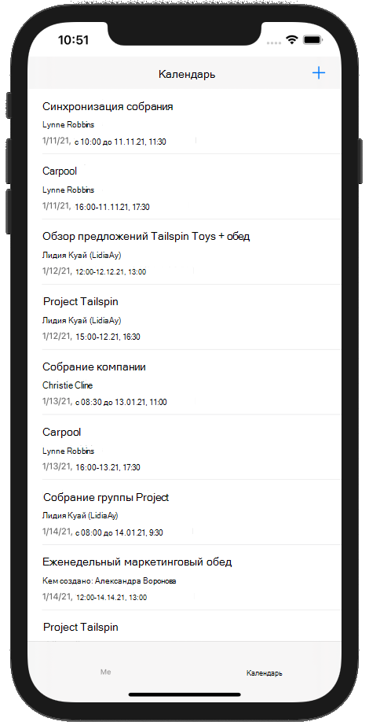

<!-- markdownlint-disable MD002 MD041 -->

В этом упражнении вы добавите Microsoft Graph в приложение. Для этого приложения вы будете использовать [пакет SDK Microsoft Graph для задания](https://github.com/microsoftgraph/msgraph-sdk-objc) с, чтобы совершать вызовы в Microsoft Graph.

## <a name="get-calendar-events-from-outlook"></a>Получение событий календаря из Outlook

В этом разделе описывается расширение `GraphManager` класса для добавления функции, позволяющей получить события и обновление `CalendarViewController` , чтобы использовать эти новые функции.

1. Откройте **графманажер. SWIFT** и добавьте в `GraphManager` класс следующий метод.

    ```Swift
    public func getEvents(completion: @escaping(Data?, Error?) -> Void) {
        // GET /me/events?$select='subject,organizer,start,end'$orderby=createdDateTime DESC
        // Only return these fields in results
        let select = "$select=subject,organizer,start,end"
        // Sort results by when they were created, newest first
        let orderBy = "$orderby=createdDateTime+DESC"
        let eventsRequest = NSMutableURLRequest(url: URL(string: "\(MSGraphBaseURL)/me/events?\(select)&\(orderBy)")!)
        let eventsDataTask = MSURLSessionDataTask(request: eventsRequest, client: self.client, completion: {
            (data: Data?, response: URLResponse?, graphError: Error?) in
            guard let eventsData = data, graphError == nil else {
                completion(nil, graphError)
                return
            }

            // TEMPORARY
            completion(eventsData, nil)
        })

        // Execute the request
        eventsDataTask?.execute()
    }
    ```

    > [!NOTE]
    > Рассмотрите, какие действия `getEvents` выполняет код.
    >
    > - URL-адрес, который будет вызываться — это `/v1.0/me/events`.
    > - Параметр `select` запроса позволяет ограничить поля, возвращаемые для каждого события, только теми, которые будут использоваться приложением.
    > - Параметр `orderby` запроса сортирует результаты по дате и времени создания, начиная с самого последнего элемента.

1. Откройте **календарвиевконтроллер. SWIFT** и замените все его содержимое приведенным ниже кодом.

    ```Swift
    import UIKit
    import MSGraphClientModels

    class CalendarViewController: UIViewController {

        @IBOutlet var calendarJSON: UITextView!

        private let spinner = SpinnerViewController()

        override func viewDidLoad() {
            super.viewDidLoad()

            // Do any additional setup after loading the view.
            self.spinner.start(container: self)

            GraphManager.instance.getEvents {
                (data: Data?, error: Error?) in
                DispatchQueue.main.async {
                    self.spinner.stop()

                    guard let eventsData = data, error == nil else {
                        self.calendarJSON.text = error.debugDescription
                        return
                    }

                    let jsonString = String(data: eventsData, encoding: .utf8)
                    self.calendarJSON.text = jsonString
                    self.calendarJSON.sizeToFit()
                }
            }
        }
    }
    ```

Теперь вы можете запустить приложение, войти и нажать в меню элемент Навигация по **календарю** . В приложении должен появиться дамп JSON событий.

## <a name="display-the-results"></a>Отображение результатов

Теперь вы можете заменить дамп JSON на какой-то способ отобразить результаты в удобном для пользователя виде. В этом разделе будет изменена `getEvents` функция, возвращающая строго типизированные объекты, и изменено `CalendarViewController` , чтобы использовать представление таблицы для отображения событий.

### <a name="update-getevents"></a>Обновление событий

1. Откройте **графманажер. SWIFT**. Замените объявление `getEvents` функции следующим.

    ```Swift
    public func getEvents(completion: @escaping([MSGraphEvent]?, Error?) -> Void)
    ```

1. Замените строку `completion(eventsData, nil)` указанным ниже кодом.

    ```Swift
    do {
        // Deserialize response as events collection
        let eventsCollection = try MSCollection(data: eventsData)
        var eventArray: [MSGraphEvent] = []

        eventsCollection.value.forEach({
            (rawEvent: Any) in
            // Convert JSON to a dictionary
            guard let eventDict = rawEvent as? [String: Any] else {
                return
            }

            // Deserialize event from the dictionary
            let event = MSGraphEvent(dictionary: eventDict)!
            eventArray.append(event)
        })

        // Return the array
        completion(eventArray, nil)
    } catch {
        completion(nil, error)
    }
    ```

### <a name="update-calendarviewcontroller"></a>Обновление Календарвиевконтроллер

1. Создайте новый файл **класса Touch Cocoa** в проекте **графтуториал** с именем `CalendarTableViewCell.swift`. Выберите **уитаблевиевцелл** в **подклассе** поля.
1. Откройте **календартаблевиевцелл. SWIFT** и добавьте в `CalendarTableViewCell` класс приведенный ниже код.

    ```Swift
    @IBOutlet var subjectLabel: UILabel!
    @IBOutlet var organizerLabel: UILabel!
    @IBOutlet var durationLabel: UILabel!

    var subject: String? {
        didSet {
            subjectLabel.text = subject
        }
    }

    var organizer: String? {
        didSet {
            organizerLabel.text = organizer
        }
    }

    var duration: String? {
        didSet {
            durationLabel.text = duration
        }
    }
    ```

1. Откройте файл **Main. Storyboard** и перейдите к **сцене календаря**. Выберите **представление** в **сцене календаря** и удалите его.

    

1. Добавьте **представление таблицы** из **библиотеки** в **сцену в календаре**.
1. Выберите представление таблицы, а затем выберите **инспектор атрибутов**. Задайте для **ячеек прототипа** значение **1**.
1. Используйте **библиотеку** , чтобы добавить три **метки** к ячейке прототипа.
1. Выберите ячейку прототип, а затем выберите **инспектор удостоверений**. Замените **Class** на **календартаблевиевцелл**.
1. Выберите **инспектор атрибутов** и **идентификатор** набора `EventCell`.
1. Выбрав **евентцелл** , выберите **инспектор подключений** и подключение `durationLabel`, `organizerLabel`а `subjectLabel` также метки, добавленные в ячейку в раскадровке.

    

1. Откройте **календарвиевконтроллер. SWIFT** и замените его содержимое приведенным ниже кодом.

    ```Swift
    import UIKit
    import MSGraphClientModels

    class CalendarViewController: UITableViewController {

        private let tableCellIdentifier = "EventCell"
        private let spinner = SpinnerViewController()
        private var events: [MSGraphEvent]?

        override func viewDidLoad() {
            super.viewDidLoad()

            // Do any additional setup after loading the view.
            self.spinner.start(container: self)

            GraphManager.instance.getEvents {
                (eventArray: [MSGraphEvent]?, error: Error?) in
                DispatchQueue.main.async {
                    self.spinner.stop()

                    guard let events = eventArray, error == nil else {
                        // Show the error
                        let alert = UIAlertController(title: "Error getting events",
                                                      message: error.debugDescription,
                                                      preferredStyle: .alert)

                        alert.addAction(UIAlertAction(title: "OK", style: .default, handler: nil))
                        self.present(alert, animated: true)
                        return
                    }

                    self.events = events
                    self.tableView.reloadData()
                }
            }
        }

        // Number of sections, always 1
        override func numberOfSections(in tableView: UITableView) -> Int {
            return 1
        }

        // Return the number of events in the table
        override func tableView(_ tableView: UITableView, numberOfRowsInSection section: Int) -> Int {
            return events?.count ?? 0
        }

        override func tableView(_ tableView: UITableView, cellForRowAt indexPath: IndexPath) -> UITableViewCell {
            let cell = tableView.dequeueReusableCell(withIdentifier: tableCellIdentifier, for: indexPath) as! CalendarTableViewCell

            // Get the event that corresponds to the row
            let event = events?[indexPath.row]

            // Configure the cell
            cell.subject = event?.subject
            cell.organizer = event?.organizer?.emailAddress?.name

            // Build a duration string
            let duration = "\(self.formatGraphDateTime(dateTime: event?.start)) to \(self.formatGraphDateTime(dateTime: event?.end))"
            cell.duration = duration

            return cell
        }

        private func formatGraphDateTime(dateTime: MSGraphDateTimeTimeZone?) -> String {
            guard let graphDateTime = dateTime else {
                return ""
            }

            // Create a formatter to parse Graph's date format
            let isoFormatter = DateFormatter()
            isoFormatter.dateFormat = "yyyy-MM-dd'T'HH:mm:ss.SSSSSSS"

            // Specify the timezone
            isoFormatter.timeZone = TimeZone(identifier: graphDateTime.timeZone!)

            let date = isoFormatter.date(from: graphDateTime.dateTime)

            // Output like 5/5/2019, 2:00 PM
            let dateFormatter = DateFormatter()
            dateFormatter.dateStyle = .short
            dateFormatter.timeStyle = .short

            return dateFormatter.string(from: date!)
        }
    }
    ```

1. Запустите приложение и войдите в систему, а затем коснитесь вкладки **Календарь** . Вы должны увидеть список событий.

    
