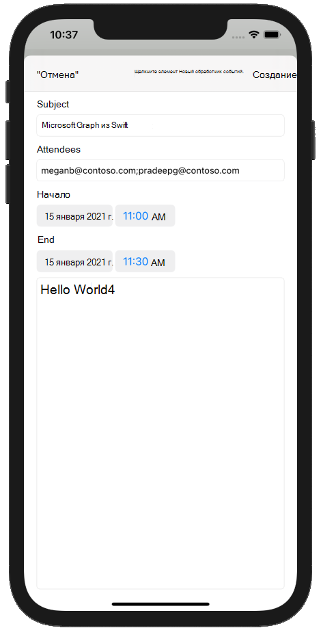

<!-- markdownlint-disable MD002 MD041 -->

В этом разделе вы добавим возможность создания событий в календаре пользователя.In this section you will add the ability to create events on the user's calendar.

1. Откройте **GraphManager.swift** и добавьте следующую функцию для создания нового события в календаре пользователя.Open **GraphManager.swift** and add the following function to create a new event on the user's calendar.

    :::code language="swift" source="../demo/GraphTutorial/GraphTutorial/GraphManager.swift" id="CreateEventSnippet":::

1. Создайте файл **класса Cocoa Touch в** папке **GraphTutorial** с именем `NewEventViewController` .Create a new **Cocoa Touch Class** file in the **GraphTutorial** folder named `NewEventViewController`. Выберите **UIViewController** в **подклассе** поля.Choose **UIViewController** in the **Subclass of** field.
1. Откройте **NewEventViewController.swift** и замените его содержимое на следующее.Open **NewEventViewController.swift** and replace its contents with the following.

    :::code language="swift" source="../demo/GraphTutorial/GraphTutorial/NewEventViewController.swift" id="NewEventViewControllerSnippet":::

1. Откройте **main.storyboard.**Open **Main.storyboard**. Используйте **библиотеку для** перетаскивания **контроллера представления** в storyboard.Use the **Library** to drag a **View Controller** onto the storyboard.
1. С помощью **библиотеки добавьте** на контроллер представления **панели** навигации.Using the **Library**, add a **Navigation Bar** to the view controller.
1. Дважды щелкните **заголовок** на панели навигации и обновите его до `New Event` .Double-click the **Title** in the navigation bar and update it to `New Event`.
1. С помощью **библиотеки добавьте** элемент кнопки **панели** в левую часть панели навигации.Using the **Library**, add a **Bar Button Item** to the left-hand side of the navigation bar.
1. Выберите новую кнопку панели, а затем — **инспектор атрибутов.**Select the new bar button, then select the **Attributes Inspector**. Измените **заголовок** на `Cancel` .Change **Title** to `Cancel`.
1. С помощью **библиотеки добавьте** элемент кнопки **панели** в правую часть панели навигации.Using the **Library**, add a **Bar Button Item** to the right-hand side of the navigation bar.
1. Выберите новую кнопку панели, а затем — **инспектор атрибутов.**Select the new bar button, then select the **Attributes Inspector**. Измените **заголовок** на `Create` .Change **Title** to `Create`.
1. Выберите контроллер представления, а затем выберите **инспектор удостоверений.**Select the view controller, then select the **Identity Inspector**. Измените **класс** **на NewEventViewController.**Change **Class** to **NewEventViewController**.
1. Добавьте в представление следующие элементы **управления** из библиотеки.Add the following controls from the **Library** to the view.

    - Добавьте **метку** под панели навигации.Add a **Label** under the navigation bar. За установите его текст `Subject` .Set its text to `Subject`.
    - Добавьте **текстовое поле** под меткой.Add a **Text Field** under the label. **Задайте для атрибута Placeholder** задайте его `Subject` ..Set its **Placeholder** attribute to `Subject`.
    - Добавьте **метку** под текстовым полем.Add a **Label** under the text field. За установите его текст `Attendees` .Set its text to `Attendees`.
    - Добавьте **текстовое поле** под меткой.Add a **Text Field** under the label. **Задайте для атрибута Placeholder** задайте его `Separate multiple entries with ;` ..Set its **Placeholder** attribute to `Separate multiple entries with ;`.
    - Добавьте **метку** под текстовым полем.Add a **Label** under the text field. За установите его текст `Start` .Set its text to `Start`.
    - Добавьте под **меткой "Выбор** даты".Add a **Date Picker** under the label. Установите для **предпочитаемого** стиля **компактный,** **его интервал** **составляет 15** минут, а высоту **35.**Set its **Preferred Style** to **Compact**, its **Interval** to **15 minutes**, and its height to **35**.
    - Добавьте **метку** в подстройку "Выбор даты".Add a **Label** under the date picker. За установите его текст `End` .Set its text to `End`.
    - Добавьте под **меткой "Выбор** даты".Add a **Date Picker** under the label. Установите для **предпочитаемого** стиля **компактный,** **его интервал** **составляет 15** минут, а высоту **35.**Set its **Preferred Style** to **Compact**, its **Interval** to **15 minutes**, and its height to **35**.
    - Добавьте представление **текста в** подстройке "Выбор даты".Add a **Text View** under the date picker.

1. Выберите новый **контроллер представления событий** и используйте connection **Inspector** для подключения к следующим подключениям.Select the **New Event View Controller** and use the **Connection Inspector** to make the following connections.

    - Подключите **полученное** действие отмены к **кнопке** "Отмена панели".Connect the **cancel** received action to the **Cancel** bar button.
    - Подключите **полученное действие createEvent** к кнопке **"Создать** планку".Connect the **createEvent** received action to the **Create** bar button.
    - Подключите **розетку темы** к первому текстовом полю.Connect the **subject** outlet to the first text field.
    - Подключите **выход участников** к второму текстовом полю.Connect the **attendees** outlet to the second text field.
    - Подключите **точки** начала к первому выбору даты.Connect the **start** outlet to the first date picker.
    - Подключите **конечный** выход к второму выбору даты.Connect the **end** outlet to the second date picker.
    - Подключите **выходной текст** к текстовом представлению.Connect the **body** outlet to the text view.

1. Добавьте следующие ограничения.Add the following constraints.

    - **Панель навигации****Navigation Bar**
        - Пробел в безопасную зону, значение: 0Leading space to Safe Area, value: 0
        - После пробела в "Безопасная область", значение: 0Trailing space to Safe Area, value: 0
        - Верхнее место в безопасной области, значение: 0Top space to Safe Area, value: 0
        - Высота, значение: 44Height, value: 44
    - **Метка темы****Subject Label**
        - Пробел в поле представления, значение: 0Leading space to View margin, value: 0
        - В окн. место в поле просмотра, значение: 0Trailing space to View margin, value: 0
        - Верхнее пространство для панели навигации, значение: 20Top space to Navigation Bar, value: 20
    - **Поле "Текст темы"****Subject Text Field**
        - Пробел в поле представления, значение: 0Leading space to View margin, value: 0
        - В окн. место в поле просмотра, значение: 0Trailing space to View margin, value: 0
        - Верхнее пространство для метки субъекта, значение: СтандартныйTop space to Subject Label, value: Standard
    - **Метка "Участники"****Attendees Label**
        - Пробел в поле представления, значение: 0Leading space to View margin, value: 0
        - В окн. место в поле просмотра, значение: 0Trailing space to View margin, value: 0
        - Верхнее пространство для текстового поля темы, значение: СтандартныйTop space to Subject Text Field, value: Standard
    - **Текстовое поле участников****Attendees Text Field**
        - Пробел в поле представления, значение: 0Leading space to View margin, value: 0
        - В окн. место в поле просмотра, значение: 0Trailing space to View margin, value: 0
        - Top space to Attendees Label, value: StandardTop space to Attendees Label, value: Standard
    - **Метка "Начните"****Start Label**
        - Пробел в поле представления, значение: 0Leading space to View margin, value: 0
        - В окн. место в поле просмотра, значение: 0Trailing space to View margin, value: 0
        - Верхнее пространство для текстового поля темы, значение: СтандартныйTop space to Subject Text Field, value: Standard
    - **Выбор даты начала****Start Date Picker**
        - Пробел в поле представления, значение: 0Leading space to View margin, value: 0
        - В окн. место в поле просмотра, значение: 0Trailing space to View margin, value: 0
        - Top space to Attendees Label, value: StandardTop space to Attendees Label, value: Standard
        - Высота, значение: 35Height, value: 35
    - **End Label****End Label**
        - Пробел в поле представления, значение: 0Leading space to View margin, value: 0
        - В окн. место в поле просмотра, значение: 0Trailing space to View margin, value: 0
        - Верхнее место для начала выбор даты, значение: СтандартныйTop space to Start Date Picker, value: Standard
    - **Выбор даты окончания****End Date Picker**
        - Пробел в поле представления, значение: 0Leading space to View margin, value: 0
        - В окн. место в поле просмотра, значение: 0Trailing space to View margin, value: 0
        - Верхнее место в конце метки, значение: СтандартныйTop space to End Label, value: Standard
        - Высота: 35Height: 35
    - **Представление текста в тексте****Body Text View**
        - Пробел в поле представления, значение: 0Leading space to View margin, value: 0
        - В окн. место в поле просмотра, значение: 0Trailing space to View margin, value: 0
        - Top space to End Date Picker, value: StandardTop space to End Date Picker, value: Standard
        - Нижнее пространство для поля просмотра, значение: 0Bottom space to View margin, value: 0

    

1. Выберите **"Сцена календаря",** а затем выберите **"Connections Inspector".**Select the **Calendar Scene**, then select the **Connections Inspector**.
1. В **области "Триггерные сеги"** перетащите незаполненный круг рядом с вручную на контроллер представления нового события в storyboard.  Under **Triggered Segues**, drag the unfilled circle next to **manual** onto the **New Event View Controller** on the storyboard. Выберите **"Представить" модально** во всплывающее меню.Select **Present Modally** in the pop-up menu.
1. Выберите только что добавленную сегу, а затем — **инспектор атрибутов.**Select the segue you just added, then select the **Attributes Inspector**. Установите **для поля "Идентификатор" (Identifier)** `showEventForm` (Идентификатор).Set the **Identifier** field to `showEventForm`.
1. Подключите **полученное действие showNewEventForm** к кнопке **+** панели навигации.Connect the **showNewEventForm** received action to the **+** navigation bar button.
1. Сохраните изменения и перезапустите приложение.Save your changes and restart the app. Перейдите на страницу календаря и нажмите **+** кнопку.Go to the calendar page and tap the **+** button. Заполните форму и нажмите **кнопку "Создать",** чтобы создать новое событие.Fill in the form and tap **Create** to create a new event.

    
